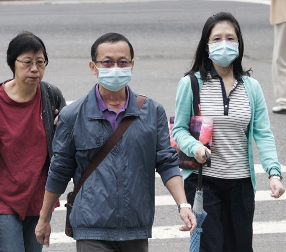
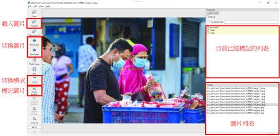
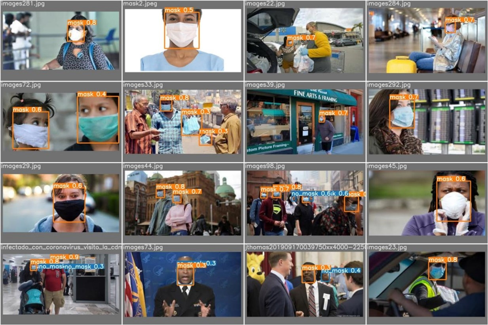

# yolov7 Uses GoogleColab

一個在Google Colab實現yolov7的範例程式碼，可以做物件偵測。

在本範例中使用以下資料庫，該資料庫包含有/無戴口罩的人們。

[資料庫下載](https://www.mdeditor.tw/)

在使用labelme做完標記後，執行yolov7.ipynb來訓練物件偵測模型。

測試結果如下，能框出並區分人們是否有戴口罩。

